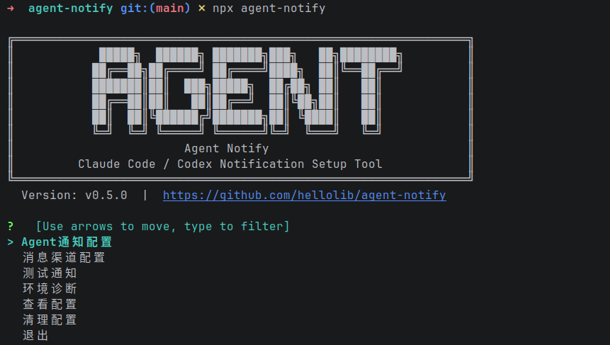
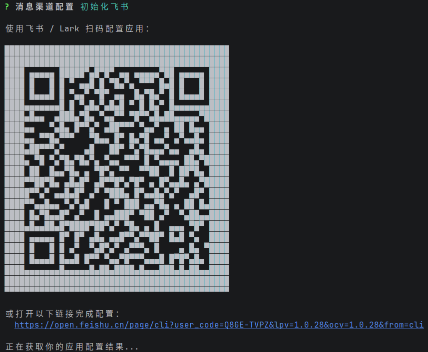
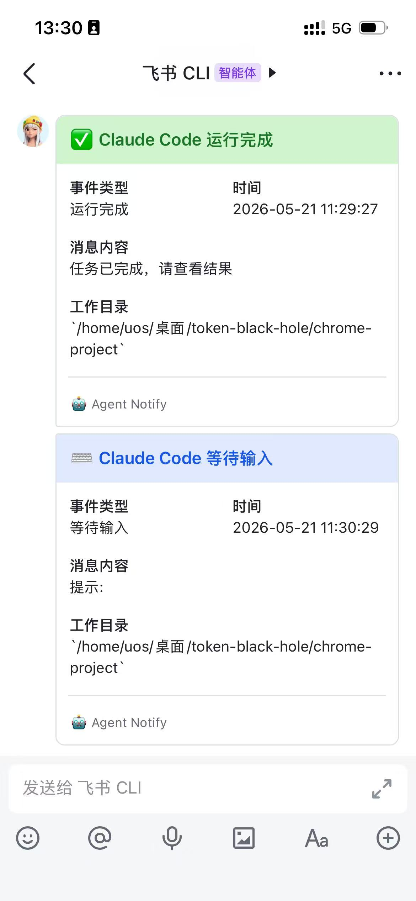
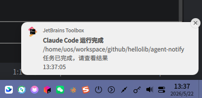

# agent-notify

[](https://go.dev/)
[](https://opensource.org/licenses/MIT)
[](https://github.com/hellolib/agent-notify/releases)

一个面向 AI Agent 的通知配置工具。支持将 Claude Code、Codex 等 Agent 的事件通知推送到飞书和系统通知。

## 工作流程

<p align="center">
  
</p>

## 功能特性

- 🖥️ **系统通知** - 支持 macOS、Linux、Windows 系统通知
- 📱 **飞书通知** - 支持一键扫码绑定、支持飞书机器人消息推送
- 🔔 **事件订阅** - Claude Code 支持 4 种事件；Codex 支持 2 种事件


### 支持的事件

| 事件 | 说明 | Claude Code | Codex |
|------|------|:---:|:---:|
| `permission_required` | Agent 需要授权（如执行命令） | ✅ | ✅ |
| `input_required` | Agent 等待用户输入 | ✅ | — |
| `run_completed` | 任务执行完成 | ✅ | ✅ |
| `run_failed` | 任务执行失败 | ✅ | — |

说明：

- Claude Code 通过 `~/.claude/settings.json` 的 hooks 订阅四个事件（`PermissionRequest`、`Notification`、`Stop`、`PostToolUseFailure`）。
- Codex 通过 `~/.codex/hooks.json` 订阅 `PermissionRequest` 与 `Stop`，分别映射到 `permission_required` 与 `run_completed`。`input_required` 与 `run_failed` Codex 目前没有对应 hook，因此暂不支持。


## 快速开始

```bash
npx agent-notify
```

首次运行会从 GitHub Releases 下载当前 npm 包版本对应平台的二进制文件，并安装到：

- macOS / Linux: `~/.agent-notify/agent-notify`
- Windows: `~/.agent-notify/agent-notify.exe`

之后每次运行 `npx agent-notify` 时都会检查本地二进制版本：

- 本地不存在：自动下载
- 本地版本落后：自动更新
- 本地版本不落后：直接运行本地二进制

launcher 不会持久修改你的 PATH，而是始终用绝对路径执行已安装的真实二进制。

> **注意**: Codex 通过 `~/.codex/hooks.json` 接入 Codex 官方 hooks 系统，目前仅订阅 `PermissionRequest`、`Stop` 两个事件（对应 `permission_required` 与 `run_completed`）。首次安装后请在 codex 内运行 `/hooks` 完成 trust 审核。

### 支持的平台

- macOS amd64
- macOS arm64
- Linux amd64
- Linux arm64
- Windows amd64
- Windows arm64

## 配置文件

agent-notify 自身配置位于 `~/.agent-notify/config.yaml`。

Agent 集成配置位置：

- Claude Code: `~/.claude/settings.json`（写入 hooks → 命令 `agent-notify handle-claude-hook`）
- Codex: `~/.codex/hooks.json`（写入 hooks → 命令 `agent-notify handle-codex-hook`，需在 codex 内运行 `/hooks` 完成 trust）

```yaml
version: 1
agent:
  claude_code:
    enabled: true
    install_scope: user
  codex:
    enabled: false
    install_scope: user
notify:
  claude_code:
    events:
      - permission_required
      - input_required
      - run_completed
      - run_failed
    channels:
      system:
        enabled: true
      feishu:
        enabled: false
  codex:
    events:
      - permission_required
      - run_completed
    channels:
      system:
        enabled: false
      feishu:
        enabled: false
behavior:
  dedupe_seconds: 60
  send_timeout_seconds: 5
  locale: zh-CN
```

## 效果图
### 软件配置

<p align="center">
  
</p>

### 飞书绑定

<p align="center">
  
</p>

### 飞书通知

<p align="center">
  
</p>

### 系统通知

<p align="center">
  
</p>


## Friendship Link

Thanks for the support and feedback from the friends at [LINUX DO](https://linux.do/). 
